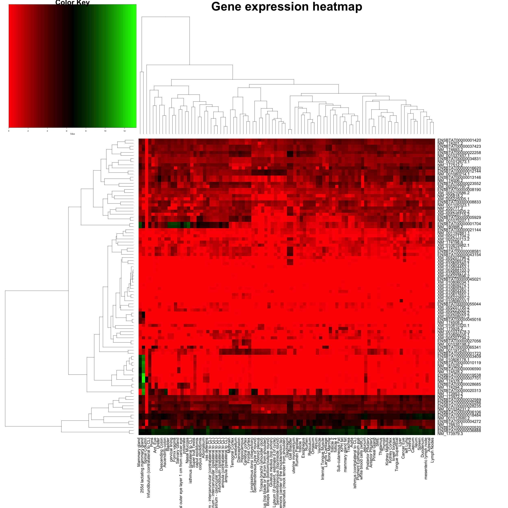
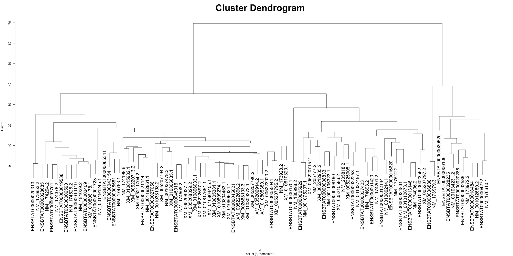

# intermine2heatmap

Reads a table (csv or tsv) formatted as follows

Example

    transcript_id,tissue,score
    NM_173928.2,t1,20
    NM_173928.2,t2,10
    NM_173928.2,t3,0
    NM_173928.2,t4,10
    NM_173928.2,t5,20
    NM_173928.2,t6,30
    NM_173928.2,t7,20
    NM_173928.2,t8,10

This is a "long form" or melted form of a matrix, and uses reshape2 to cast back into matrix form

It is transformed it into a heatmap based on the transcript IDs and the FPKM values (log10 transformed)

Usage is amenable for intermine expression data outputs

## Usage

### Heatmap

Generate a heatmap

    intermine2heatmap input.tsv output.png|pdf|html "title"

This will output a png, pdf or html page with your output. PDF/PNG powered by heatmap.2, HTML powered by d3heatmap

### Clusters

This will output a text file with the clusters

    intermine2clusters input.tsv clusters_filename_prefix num_clusters

This will generate `clusters_filename_prefix.txt` and `clusters_filename_prefix.png`

## Sample output

### Heatmap

### d3heatmap

### Cluster tree

### Cluster text

Shows the cluster assignment of the gene

    $ head clusters.txt
    ENSBTAT00000001420  1
    ENSBTAT00000001704  1
    ENSBTAT00000001723  1
    ENSBTAT00000003409  1
    ENSBTAT00000004272  2
    ENSBTAT00000005929  1
    ENSBTAT00000006106  2
    ENSBTAT00000006590  1
    ENSBTAT00000007701  1
    ENSBTAT00000008190  1
    ....
